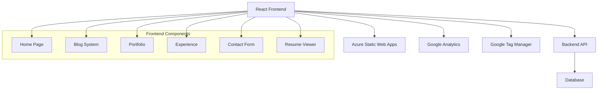

# 🌟 Sai Sri Harsha Guddati - Personal Portfolio & Blog

<div align="center">


**A modern, responsive personal portfolio and blog website showcasing my journey as a Software Development/AIML Engineer**

[🌐 Live Demo](https://saisriharsha.me) • [📧 Contact](mailto:saisriharshaguddati1@gmail.com) • [💼 Experience](/experience)

</div>

---

## ✨ Features

<table>
<tr>
<td width="50%">

### 🎨 **Modern Design**
- **Dark/Light Theme Toggle** with system preference detection
- **Glassmorphism Effects** with backdrop blur
- **Smooth Animations** and hover effects
- **Responsive Design** for all devices
- **Custom CSS Variables** for consistent theming

</td>
<td width="50%">

### 🚀 **Performance**
- **React 18** with modern hooks
- **Code Splitting** and lazy loading
- **SEO Optimized** with dynamic sitemap
- **Google Analytics** integration
- **Web Vitals** monitoring

</td>
</tr>
<tr>
<td width="50%">

### 📱 **User Experience**
- **Typewriter Effect** on homepage
- **Smooth Scrolling** navigation
- **Loading States** and error handling
- **Form Validation** with feedback
- **Mobile-First** approach

</td>
<td width="50%">

### 🛠 **Technical Features**
- **RESTful API** integration
- **Markdown Support** for blog posts
- **PDF Viewer** for resume
- **Contact Form** with backend
- **Portfolio Showcase** with pagination

</td>
</tr>
</table>

---

## 🏗️ Architecture



---

## 🎯 Pages & Functionality

### 🏠 **Home Page**
- **Interactive Typewriter Effect** showcasing my roles
- **Professional Profile Image** with hover animations
- **Personal Bio Section** with engaging content
- **Gradient Text Effects** and modern typography

### 📝 **Blog System**
- **Dynamic Blog Posts** fetched from REST API
- **Markdown Rendering** with React-Markdown
- **Pagination** for better content organization
- **Individual Post Pages** with full content

### 💼 **Portfolio**
- **Project Showcase** with descriptions and links
- **Responsive Grid Layout** adapting to screen sizes
- **Hover Effects** and smooth transitions
- **Paginated Display** for optimal loading

### 🎯 **Experience**
- **Professional Timeline** with detailed descriptions
- **Interactive Cards** with hover effects
- **Skills Highlighting** and achievement metrics
- **Resume Integration** with PDF viewer

### 📞 **Contact**
- **Interactive Contact Form** with validation
- **Direct Email/Phone Links** with icons
- **Success Feedback** and error handling
- **Thank You Page** with navigation

---

## 🛠️ Tech Stack

<div align="center">

| Frontend | Styling | Tools | Analytics |
|----------|---------|-------|-----------|
|  |  |  |  |
|  |  |  |  |
|  |  |  |  |

</div>

### 📦 **Key Dependencies**

```json
{
  "react": "^18.3.1",
  "react-router-dom": "^7.1.5",
  "react-markdown": "^9.0.3",
  "@react-pdf-viewer/core": "^3.12.0",
  "framer-motion": "^12.4.3",
  "axios": "^1.7.9",
  "react-ga4": "^2.1.0"
}
```

---

## 🚀 Quick Start

### Prerequisites
- **Node.js** (v16 or higher)
- **npm** or **yarn**

### Installation

```bash
# Clone the repository
git clone https://github.com/saisriharsha19/personal-website.git

# Navigate to project directory
cd personal-website

# Install dependencies
npm install

# Start development server
npm start
```

### 🌐 **Available Scripts**

| Command | Description |
|---------|-------------|
| `npm start` | 🚀 Start development server at `http://localhost:3000` |
| `npm build` | 🏗️ Build for production |
| `npm test` | 🧪 Run test suite |
| `npm run eject` | ⚙️ Eject from Create React App |

---

## 🎨 Design System

### 🌈 **Color Palette**

```css
/* Primary Colors */
--primary: #00ff88;     /* Vibrant Green */
--secondary: #60efff;   /* Electric Blue */

/* Theme Colors */
--text-light: #f5f5f5;  /* Light Gray */
--text-dark: #0a0a0a;   /* Dark Gray */
--bg-light: #ffffff;    /* Pure White */
--bg-dark: #0a0a0a;     /* Deep Black */
```

### 🎭 **Theme System**
- **Automatic Detection** of system preferences
- **localStorage Persistence** for user choice
- **Smooth Transitions** between themes
- **CSS Custom Properties** for consistency

### 📱 **Responsive Breakpoints**

| Device | Breakpoint | Layout |
|--------|------------|--------|
| Mobile | `≤ 480px` | Single column, stacked navigation |
| Tablet | `≤ 768px` | Adapted grid, collapsible elements |
| Desktop | `> 768px` | Full grid layout, side navigation |

---

## 🔧 Configuration

### 📊 **Analytics Setup**

```javascript
// Google Analytics 4
const config = {
  measurementId: 'G-SBFHT4D8YE',
  streamId: '10246799672',
  debug: process.env.NODE_ENV === 'development'
};

// Google Tag Manager
const tagManagerArgs = {
  gtmId: 'GTM-K5B486R5'
};
```

### 🌐 **API Endpoints**

```javascript
const API_BASE = 'https://personalwebsitebackend-gthafrgadzc2argc.eastus2-01.azurewebsites.net';

// Blog API
GET /blog/          // Fetch all blog posts
GET /blog/:id       // Fetch specific post

// Portfolio API  
GET /portfolio/     // Fetch portfolio items

// Contact API
POST /contact/      // Submit contact form
```

---

## 📁 Project Structure

```
src/
├── 📄 App.js                 # Main application component
├── 🎨 App.css                # Global styles and theme system
├── 🌍 ThemeContext.js         # Theme management context
├── 📊 analytics.js            # Google Analytics configuration
├── 🧩 components/
│   ├── 🧭 Navbar.jsx          # Navigation component
│   └── 🦶 Footer.jsx          # Footer component
├── 📑 pages/
│   ├── 🏠 Home.jsx            # Homepage with typewriter effect
│   ├── 📝 Blog.jsx            # Blog listing page
│   ├── 📄 FullPost.jsx        # Individual blog post
│   ├── 💼 Portfolio.jsx       # Portfolio showcase
│   ├── 🎯 ExperiencePage.jsx  # Professional experience
│   ├── 📞 Contact.jsx         # Contact form
│   ├── 📄 Resume.jsx          # PDF resume viewer
│   ├── 🙏 ThankYouPage.jsx    # Form success page
│   └── 🌓 ThemeToggle.jsx     # Theme switcher
├── 🖼️ images/                # Static assets
└── 🔧 icons/                 # Social media icons
```

---

## 🌟 Highlights

### 💫 **Visual Effects**
- **Glassmorphism** design with backdrop filters
- **Gradient Text** effects for headings
- **Smooth Hover** animations and transforms
- **Loading Spinners** with custom styling
- **Typewriter Animation** on homepage

### 🎯 **User Experience**
- **Instant Navigation** with React Router
- **Error Boundaries** with user-friendly messages
- **Loading States** for all async operations
- **Form Validation** with real-time feedback
- **Accessibility** considerations throughout

### 📈 **Performance**
- **Lazy Loading** for components
- **Image Optimization** with proper sizing
- **Minimal Bundle Size** with code splitting
- **Fast Loading** with optimized assets
- **SEO Optimization** with meta tags

---

## 🤝 Contributing

I welcome contributions to improve this portfolio! Here's how you can help:

1. **🍴 Fork** the repository
2. **🌿 Create** a feature branch (`git checkout -b feature/AmazingFeature`)
3. **💾 Commit** your changes (`git commit -m 'Add some AmazingFeature'`)
4. **📤 Push** to the branch (`git push origin feature/AmazingFeature`)
5. **🔄 Open** a Pull Request

---

## 📞 Contact & Connect

<div align="center">

### Let's Build Something Amazing Together! 🚀

[](mailto:saisriharshaguddati1@gmail.com)
[](tel:+13526658709)

[](https://www.linkedin.com/in/sai-sri-harsha-guddati-552373180/)
[](https://x.com/SriHarsha_19)
[](https://github.com/saisriharsha19)

</div>

---

## 📄 License

This project is open source and available under the [MIT License](LICENSE).

---

<div align="center">

### 🌟 **Made with ❤️ by Sai Sri Harsha Guddati** 🌟

**Currently pursuing MS in Computer Science at University of Florida**  
**Former R&D Software Engineer at Tata Consultancy Services**


*⭐ If you like this project, please consider giving it a star!*

</div>
